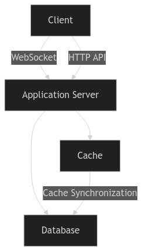
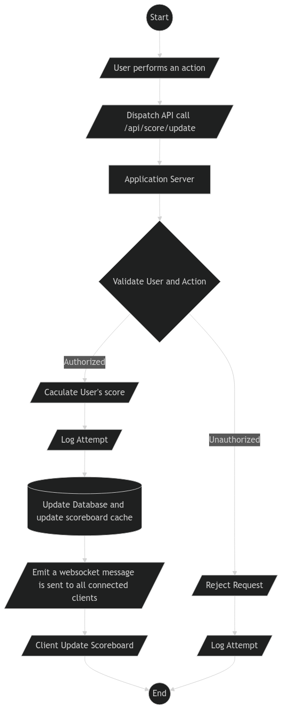

# Problem 6: Architecture

### Software Requirements

1. We have a website with a score board, which shows the top 10 user’s scores.
2. We want live update of the score board.
3. User can do an action (which we do not need to care what the action is), completing this action will increase the user’s score.
4. Upon completion the action will dispatch an API call to the application server to update the score.
5. We want to prevent malicious users from increasing scores without authorisation.

## Specification for Back-end (Scoreboard module)
### Database
#### User Table
- `userId` - primary key (auto-increment)
- `userName` - unique
- `score`- user's current score (default to 0) (int)
- email - unique
- password - hashed
- ... additional fields as required
#### Action Table
- `actionId` - ...
- `actionName` - unique name of the action
- `score` - point awarded for the action (must me > 0) (int)
- desription - action details
- ... additional fields as required
#### Scoreboard Cache
- Key: `scoreboard:top10`
- Value: Sorted list of user IDs and their scores

### APIs
#### GET User Detail
- Endpoint: `/api/user/:userId`
- Method: `GET`
- Desc: Retriveves detaild information about a specific user, including their current score
- Request Params:
    -  `userId` - the id of the use
- Response:
```json
{
    "userId": 1,
    "userName": "hdnguyendev",
    ...
    "score": 1000
}
```
#### POST Update Score
- Endpoint: `/api/score/update`
- Method: `POST`
- Desc: Updates the user's score upon completion of an action, validates the user and ensures the action is authorized
- Request Body:
```json
{
    "userId": 1,
    "actionId": 2,
}
```
but required authentication and authorization (using api-key or bearer token, ...)
- Response:
```json
{
    "status": "success",
    "message": "Score updated successfully",
    ...
    "updatedScore": 1500
}
```
or (on failure)
```json
{
    "status": "error",
    "message": "Unauthorized action or invalid token"
}
```
### GET Top 10 Scores
- Endpoint: `/api/scoreboard/top10`
- Method: `GET`
- Desc: Retrieves the top 10 scores
- Request Params: None
- Response:
```json
[
    {
        "userId": 1,
        "userName": "hdnguyendev",
        "score": 1500
    },
    {
        "userId": 2,
        "userName": "duynguyenod",
        "score": 1450
    },
    ...
]
```
## Security Considerations
**1. Authentication & Authorization:**
- Enforce authentication for all API requests
- Can use `JWT`, ... for this

**2. Input Validation:**
- Validate `userId`, `actionId` and other inputs to prevent SQL injection and ensure data intergrity

**3. Rate Limiting:**
- Implement rate limitting to avoid abuse of the `/api/score/update` endpoint.

**4. Prevent Score Tampering:**
- Ensure scores are updated only through validated and logged actions


## Real-Time Updates
- Can use `WebSocket` for pushing real-time updates
- When a user’s score is updated, the backend recalculates the top 10 scores and publishes updates to WebSocket subscribers.
## Architecture

## Workflow
1. A user performs an action in the app
2. Send a request to /api/score/update with userId, actionId  (validated using authentication).
3. The backend updates the user's score in the database and cache, saved log
4. Emit a websocket message is sent to all connected clients
5. The frontend listens for websocket messages and updates the scoreboard in real-time



### Author
Ho Dang Nguyen (hdnguyendev)

